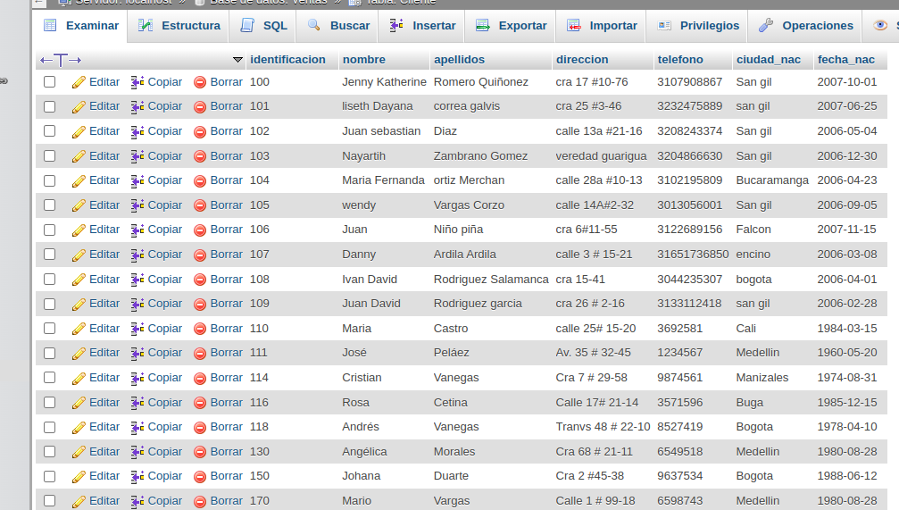
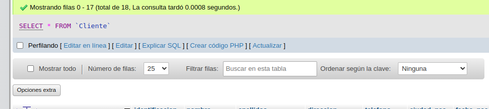
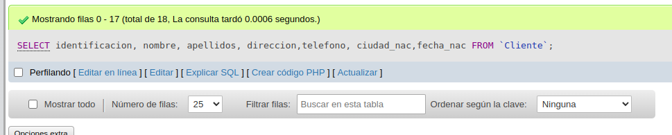
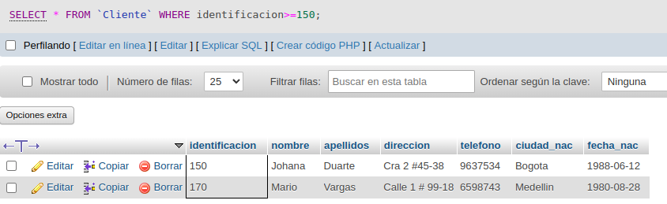
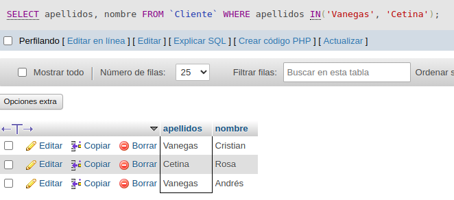
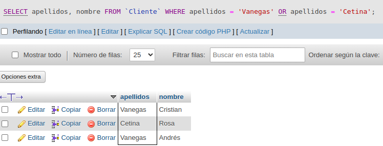
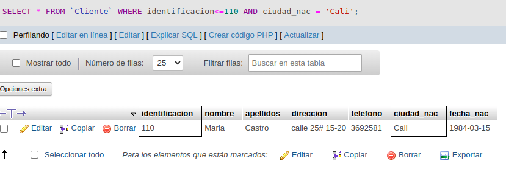
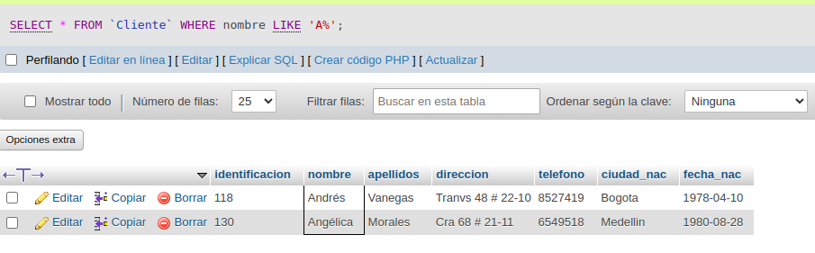
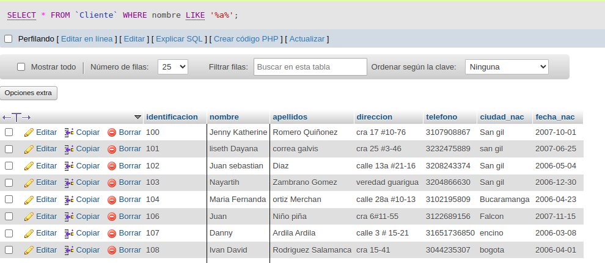
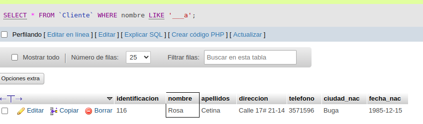

# consultas_1_sql

# Introducción a las consultas a una BD usando el lenguaje SQL

## Base de datos: Ventas

## Tabla: Cliente

## Instrucciones SELECT

- Permite seleccionar datos de una tabla.
- Su formato es: `SELECT campos_tablas FROM
  nombre_tabla``

### Consultas No. 1

1. Para visualizar toda la informacion que contiene la tabla Cliente se puede incluir con la instruccion SELECT el caracter **\*** o cada uno de los campos de la tabla.

- `SELECT * FROM Cliente`
  

- `SELECT identificacion, nombre, apellidos, direccion, telefono,ciudad_nac, fecha_nac FROM Cliente`
  

### Consultas No. 2

2. Para visualizar solamente la identificacion del cliente : `SELECT identificacion FROM Cliente`
   

### Consultas No. 3

3. Si se desea obtener los registros cuya identificacion sea mayor o igual a 150 se debe utilizar la clausula `WHERE` que especifica las condiciones que deben reunir los registros que se van a seleccionar: `SELECT * FROM Cliente WHERE identificacion>=150`
   

### Consulta No. 4

4. Se desea obtener los registros cuyos apellidos seana Vanegas o Cetina, se debe utilizar el operador `IN` que especifica los registros que se quieren visualizar de una tabla.

`SELECT apellidos, nombre  FROM Clientes WHERE apellidos IN ('Vanegas','Cetina')`

o se puede utilizar el operador `OR`

`SELECT apellidos,nombre  FROM Clientes WHERE apellidos = 'Vanegas' OR apellidos = 'Cetina'`

### Consulta No. 5

5. Se desea obtener los registros cuya identificacion sea menor de 110 y la ciudad sea cali, se debe utlizar el operador `AND`

`SELECT * FROM Cliente WHERE identificacion<=110 AND ciudad_nac = 'Cali'`

###  Consulta No. 6

6. Si se desea obtener los registros cuyos nombres empiecen por la letras 'A', se debe utilizar el operador `LIKE`que utiliza los patrones `%` (todos) y `_` (caracter).

`SELECT * FROM Cliente WHERE nombre LIKE 'A%'`

### Consultas No. 7

7. Se desea obtener los registros cuyos nombre contengan la letra 'a'

`SELECT * FROM Cliente WHERE nombre LIKE '%a%'`

### Consultas No. 8

8. Se desea obener los registros donde la cuarta letra del nombre del cliente sea la letra 'a'

`SELECT * FROM Cliente WHERE nombre LIKE '___a'`
