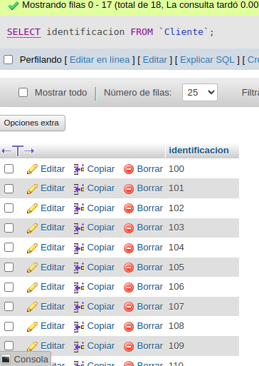

# consultas_1_sql

# Introducción a las consultas a una BD usando el lenguaje SQL

## Base de datos: Ventas

## Tabla: Cliente

## Instrucciones SELECT

- Permite seleccionar datos de una tabla.
- Su formato es: `SELECT campos_tablas FROM
  nombre_tabla``

### Consultas No. 1

1. Para visualizar toda la informacion que contiene la tabla Cliente se puede incluir con la instruccion SELECT el caracter **\*** o cada uno de los campos de la tabla.

- `SELECT * FROM Cliente`
  

- `SELECT identificacion, nombre, apellidos, direccion, telefono,ciudad_nac, fecha_nac FROM Cliente`

### Consultas No. 2

2. Para visualizar solamente la identificacion del cliente : `SELECT identificacion FROM Cliente`

### Consultas No. 3

3. Si se desea obtener los registros cuya identificacion sea mayor o igual a 150 se debe utilizar la clausula `WHERE` que especifica las condiciones que deben reunir los registros que se van a seleccionar: `SELECT * FROM Cliente WHERE identificacion>=150`
